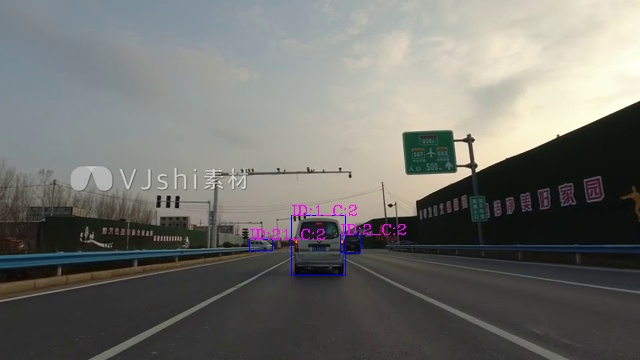
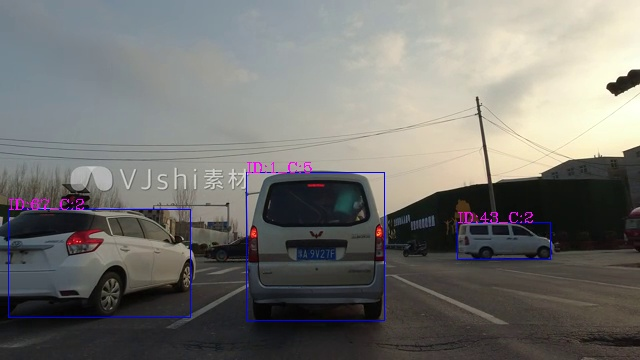

# Deepsort-YOLOv5-TensorRT
[README中文版](https://github.com/emptysoal/Deepsort-YOLOv5-TensorRT/blob/main/README-chinese.md)

## Introduction

- Based on `TensorRT-v8.2` ，speed up object tracking of  `YOLOv5-v5.0` + `deepsort` ;
- Deployment on `Jetson nano` ;
- It is also feasible on the `Linux x86_64`,  just all the Makefile and CMakeLists.txt in this project need to be modified. The path of the TensorRT and OpenCV header files and library files need be changed to the corresponding system, and the path of CUDA is generally not modified, it is best to confirm it. 

## Effect





## Environment

-  The system image burned on `Jetson nano` is `Jetpack 4.6.1`, and the original environment of `jetpack` is as follows: 

| CUDA | cuDNN | TensorRT | OpenCV |
| ---- | ----- | -------- | ------ |
| 10.2 | 8.2   | 8.2.1    | 4.1.1  |

- install library: `Eigen`

```bash
apt install libeigen3-dev
```

## Model conversion

Convert `YOLO` detection model, and `ReID` feature extraction model, into a serialized file of `TensorRT`, suffix `.plan` (my custom, it can also be `.engine` or other) 

### Original model download

- link: https://pan.baidu.com/s/1YG-A8dXL4zWvecsD6mW2ug 
- extract code: y2oz

Download and unzip,

The files in the directory are described as follows:

```bash
Deepsort
    |
    ├── ReID  # This directory stores the model of ReID feature extraction network
    │   ├── ckpt.t7  # Official PyTorch format model file
    │   └── deepsort.onnx  # onnx format model file exported from ckpt.t7
    |
    └── YOLOv5-v5.0  # This directory stores the model of the YOLOv5 object detection network
        ├── yolov5s.pt  # Official PyTorch format model file
        └── para.wts  # Model file in wts format exported from yolov5s.pt
```

### YOLO conversion

- Convert the above `yolov5s.pt` to `model.plan`, or `para.wts` to `model.plan` 
- The specific conversion method can be found in the link below, which is also a project published by the myself 

https://github.com/emptysoal/TensorRT-v8-YOLOv5-v5.0/tree/main

**Note** : When using, remember to modify `Makefile` , header files, library files path of `TensorRT` and `OpenCV` shuould be replaced for your own `Jetson nano` 

After completion, you can get `Model.plan`, which is the `TensorRT` serialization model file of  YOLOv5 object detection network. 

### ReID conversion

- Convert the above`ckpt.t7` to `deepsort.plan`，or `deepsort.onnx` to `deepsort.plan`
- Follow these steps:

```bash
# enter into directory reid_torch2trt in this project
cd reid_torch2trt

# run command:
# if jetson nano does not have pytorch，this step can be run in any environment with pytorch
python onnx_export.py
# after this command，ckpt.t7 convert to deepsort.onnx
# However, I have given deepsort.onnx, so you can skip this step and start with the following 

# Execute sequentially
make
./trt_export
# after these commands，deepsort.onnx convert to deepsort.plan
```

After completion, you can get `deepsort.plan`, which is the `TensorRT` serialization model file of the feature extraction network. 

## Run deepsort

- Start compiling and running the code for the object tracking
- Follow these steps:

```bash
# enter into directory yolov5-deepsort-tensorrt in this project
cd yolov5-deepsort-tensorrt
mkdir resources
# Copy the 2 plan files converted above to the directory resources 
cp {TensorRT-v8-YOLOv5-v5.0}/model.plan ./resources
cp ../reid_torch2trt/deepsort.plan ./resources

mkdir test_videos  # Put the test video file into it and name it demo.mp4

vim src/main.cpp  # You can modify some configuration information according to your requirements

mkdir build
cd build
cmake ..
make
./yolosort  # then you can see the tracking effect
```

## Reference

### reference linking

Mainly refer to the following projects:

- https://github.com/RichardoMrMu/yolov5-deepsort-tensorrt
- https://blog.csdn.net/weixin_42264234/article/details/120152117

### Improvement of this project

- The code for this project mostly references the content of the above project
- **But I have made alot of changes**, as follows:

1. The reference project `ReID` model output is a `512` dimension vector, but the code is `256` dimension, I made corrections; 

2. For `YOLOv5-v5.0` object detection network:

   2.1 The TensorRT model transformation was carried out using my own project, and **speed up pre-processing with CUDA**. 

   2.2 The TensorRT inference of YOLOv5 is encapsulated in a C++ class. It is also very convenient to use in other projects. 

3. The category filtering function is implemented. You can set the category you want to track in main.cpp, ignoring those that you do not care about. 

4. In order to adapt to TensorRT version 8, some changes have been made to the model reasoning. 

